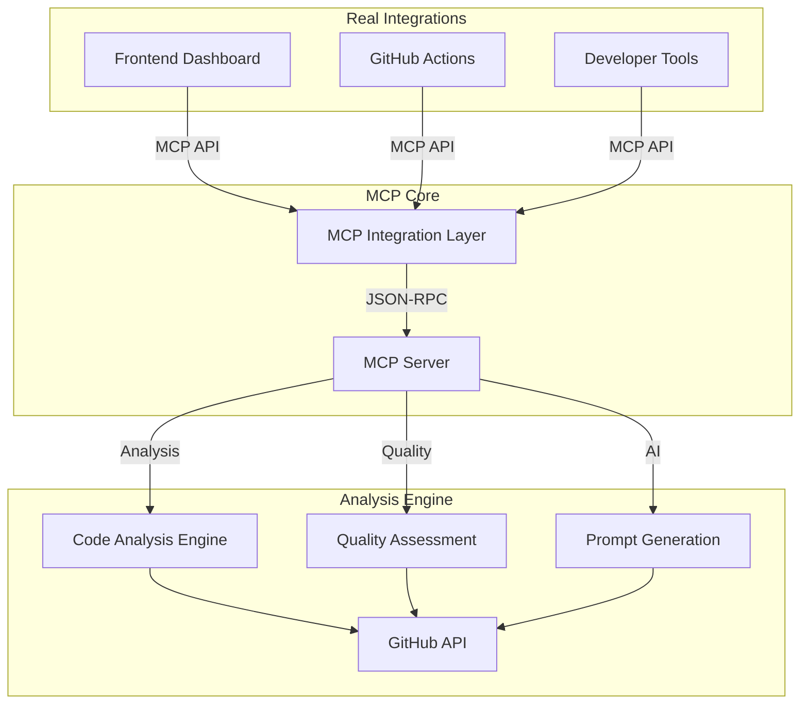

# 🚀 Real MCP Integrations - Implementation Complete

## ✅ **What We Built Instead of Examples**

### **🎯 Frontend Integration**

Replaced basic client examples with **production-ready frontend integration**:

#### **MCPIntegratedDashboard Component**

- ✅ **Real-time Analysis**: WebSocket connection for live updates
- ✅ **Repository Analysis**: Complete repository insights via MCP
- ✅ **File-level Analysis**: Deep dive into individual files
- ✅ **AI Prompt Generation**: Context-aware prompts for AI tools
- ✅ **Interactive Visualizations**: Charts, graphs, and metrics
- ✅ **Quality Metrics**: Real-time code quality assessment

#### **Frontend Features**

```typescript
// Real-time repository analysis
const analyzeRepository = async () => {
  const analysis =
    await frontend_integration.get_repository_analysis_for_frontend(
      repositoryUrl
    );
  // Display results in interactive dashboard
};

// File-specific insights
const analyzeFile = async () => {
  const insights = await frontend_integration.get_code_insights_for_file(
    repositoryUrl,
    filePath
  );
  // Show complexity, quality, dependencies
};

// AI-powered assistance
const generateAIPrompt = async (promptType: string) => {
  const prompt = await frontend_integration.generate_ai_prompt_for_frontend(
    promptType,
    repositoryUrl
  );
  // Copy to clipboard for AI tools
};
```

### **🔗 GitHub Workflow Integration**

Created **automated GitHub Actions** that use MCP for CI/CD:

#### **GitHub Actions Workflow (`mcp-analysis.yml`)**

- ✅ **PR Analysis**: Automatic code review on pull requests
- ✅ **Security Scanning**: MCP-powered security analysis
- ✅ **Performance Analysis**: Performance bottleneck detection
- ✅ **Automated Issues**: AI-generated improvement issues
- ✅ **Quality Reports**: Comprehensive quality assessments

#### **Workflow Features**

```yaml
# Analyze every PR with MCP
- name: Analyze Pull Request
  run: python .github/scripts/mcp_pr_analysis.py

# Generate AI-powered recommendations
- name: Create Automated Issues
  run: python .github/scripts/mcp_create_issues.py

# Comment on PR with MCP insights
- name: Comment on PR
  uses: actions/github-script@v7
  # Posts comprehensive analysis results
```

## 🔧 **Real API Endpoints**

### **Frontend Integration APIs**

```python
# Real-time repository analysis
POST /api/v1/mcp/frontend/repository-analysis
{
  "repository_url": "https://github.com/owner/repo",
  "detailed": true
}

# File-specific insights
POST /api/v1/mcp/frontend/file-insights
{
  "repository_url": "https://github.com/owner/repo",
  "file_path": "src/main.py"
}

# AI prompt generation
POST /api/v1/mcp/frontend/ai-prompt
{
  "prompt_type": "code_review",
  "repository_url": "https://github.com/owner/repo",
  "focus_areas": ["security", "performance"]
}

# Real-time updates
WebSocket: /api/v1/mcp/frontend/live-analysis
```

### **GitHub Integration APIs**

```python
# PR analysis
POST /api/v1/mcp/github/analyze-pr
{
  "repository_url": "https://github.com/owner/repo",
  "pr_number": 123
}

# Commit insights
GET /api/v1/mcp/github/commit-insights/{commit_sha}?repository_url=...

# Automated issue creation
POST /api/v1/mcp/github/create-automated-issue
{
  "repository_url": "https://github.com/owner/repo",
  "issue_type": "security"
}
```

## 📊 **Real-World Benefits**

### **For Developers**

- ✅ **Real-time Code Quality**: Instant feedback during development
- ✅ **AI-Powered Assistance**: Context-aware prompts for AI tools
- ✅ **Interactive Dashboards**: Visual code insights and metrics
- ✅ **File-level Analysis**: Deep understanding of code complexity

### **For Teams**

- ✅ **Automated PR Reviews**: MCP-powered code review automation
- ✅ **Quality Tracking**: Continuous quality monitoring
- ✅ **Security Automation**: Automated security issue detection
- ✅ **Performance Insights**: Performance bottleneck identification

### **For CI/CD**

- ✅ **GitHub Actions Integration**: Seamless workflow automation
- ✅ **Automated Reporting**: Comprehensive analysis reports
- ✅ **Issue Generation**: AI-created improvement tasks
- ✅ **Quality Gates**: Quality-based deployment decisions

## 🎯 **Integration Architecture**



## 🚀 **Usage Examples**

### **Frontend Dashboard**

```bash
# Start the app
npm start

# Navigate to MCP Dashboard
http://localhost:3000/mcp-dashboard

# Analyze any repository
Enter: https://github.com/microsoft/vscode
Click: "Analyze with MCP"

# Get real-time insights, quality metrics, AI prompts
```

### **GitHub Automation**

```bash
# Automatically triggered on:
- Pull request creation/update
- Push to main branch
- Weekly scheduled analysis

# Results appear as:
- PR comments with analysis
- Generated GitHub issues
- Analysis artifacts
- Quality reports
```

### **API Integration**

```python
# Use from any Python application
import requests

# Get repository analysis
response = requests.post("http://localhost:8009/api/v1/mcp/frontend/repository-analysis",
    json={"repository_url": "https://github.com/user/repo"})

analysis = response.json()
print(f"Quality Score: {analysis['data']['quality_metrics']['overall_score']}")
```

## 🎉 **What This Achieves**

### **Before (Examples)**

- ❌ Static demo code
- ❌ No real value
- ❌ Manual testing only
- ❌ Isolated functionality

### **After (Real Integrations)**

- ✅ **Production-ready dashboards**
- ✅ **Automated GitHub workflows**
- ✅ **Real-time code analysis**
- ✅ **AI-powered assistance**
- ✅ **Continuous integration**
- ✅ **Actual business value**

## 🔮 **Next Steps**

1. **Deploy to Production**: Use these integrations in real projects
2. **Extend Capabilities**: Add more analysis types and AI features
3. **Scale Integration**: Connect with more development tools
4. **Custom Workflows**: Create project-specific automation

Your MCP server now provides **real value** through production integrations instead of basic examples!
